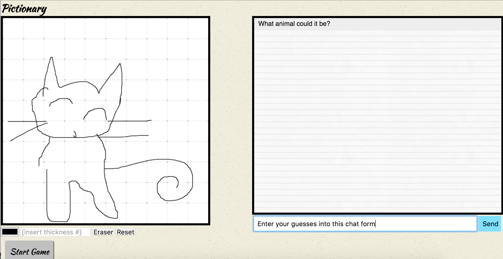

# pictionarySocketIO

# Try it out here: <https://draw-together-mttgeqvtqj.now.sh>
Used [npm now](https://www.npmjs.com/package/now) to publish/deploy the project.

## Objective
Utilize Socket.IO to create a real-time collaborative drawing application. My classmate, [@dkendrick25](https://github.com/dkendrick25) and I worked together to include an additional chat functionality which transformed the app into a Pictionary-style game
* Utilized: Socket.IO, Express Node.js, HTML5 canvas, HTML, CSS, and jQuery

### Phase 1: Establish Core Functionalities - Drawing Canvas and Chat

### Phase 2: Pretty up the visuals with fonts and background patterns

