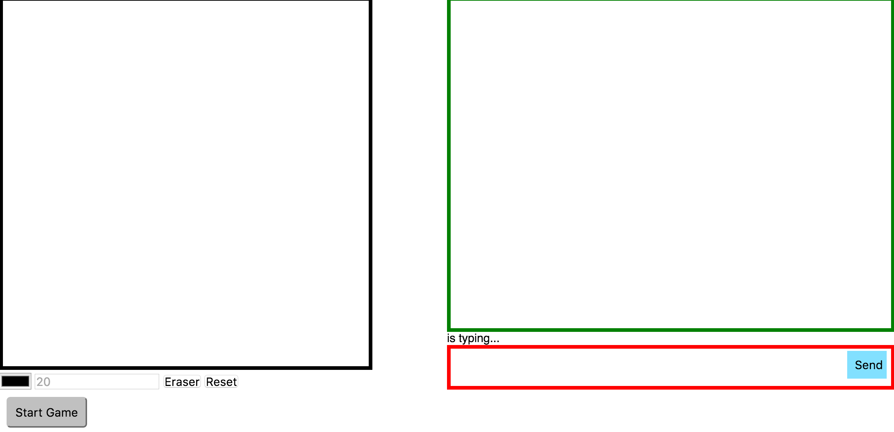

# pictionarySocketIO

##Objective
Utilize Socket.IO to create a real-time collaborative drawing application. My classmate and I worked together to include an additional chat functionality which transformed the app into a Pictionary-style game
* Utilized: Socket.IO, Express Node.js, HTML5 canvas, HTML, CSS, and jQuery

###Phase 1: Establish Core Functionality: Drawing Canvas and Chat

###Phase 2: Pretty up the visuals

